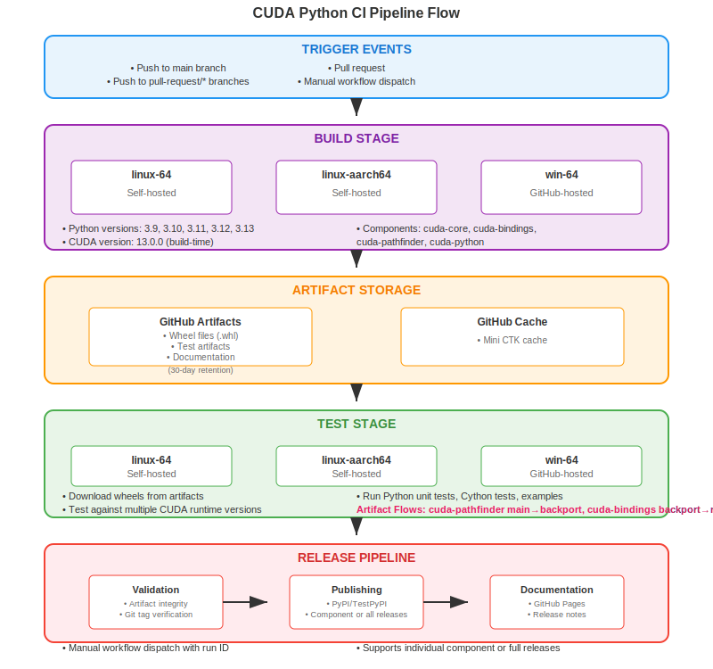
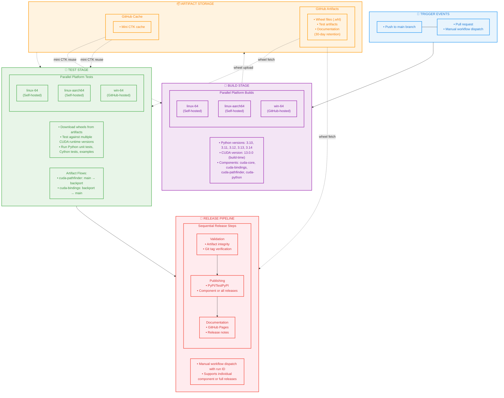

# Contributing to CUDA Python

Thank you for your interest in contributing to CUDA Python! Based on the type of contribution, it will fall into two categories:

1. You want to report a bug, feature request, or documentation issue:
    - File an [issue](https://github.com/NVIDIA/cuda-python/issues/new/choose)
    describing what you encountered or what you want to see changed.
    - The NVIDIA team will evaluate the issues and triage them, scheduling
    them for a release. If you believe the issue needs priority attention
    comment on the issue to notify the team.
2. You want to implement a feature, improvement, or bug fix:
   - Before starting work on an existing issue, please comment on the issue to express your interest and wait to be assigned by a maintainer. This helps avoid redundant effort in case the issue is already being worked on by another contributor or an NVIDIA team member.
   - Please refer to each component's guideline:
       - [`cuda.core`](https://nvidia.github.io/cuda-python/cuda-core/latest/contribute.html)
       - [`cuda.bindings`](https://nvidia.github.io/cuda-python/cuda-bindings/latest/contribute.html)<sup>[1](#footnote1)</sup>
       - [`cuda.pathfinder`](https://nvidia.github.io/cuda-python/cuda-pathfinder/latest/contribute.html)

## Table of Contents

- [Contributing to CUDA Python](#contributing-to-cuda-python)
  - [Table of Contents](#table-of-contents)
  - [Type stubs for cuda.core](#type-stubs-for-cudacore)
  - [Pre-commit](#pre-commit)
    - [Pre-commit on Windows](#pre-commit-on-windows)
  - [Signing Your Work](#signing-your-work)
  - [Code signing](#code-signing)
  - [Developer Certificate of Origin (DCO)](#developer-certificate-of-origin-dco)
  - [CI infrastructure overview](#ci-infrastructure-overview)
    - [CI Pipeline Flow](#ci-pipeline-flow)
    - [Pipeline Execution Details](#pipeline-execution-details)
    - [Branch-specific Artifact Flow](#branch-specific-artifact-flow)
      - [Main Branch](#main-branch)
      - [Backport Branches](#backport-branches)
    - [Key Infrastructure Details](#key-infrastructure-details)
  - [Code coverage](#code-coverage)


## Type stubs for cuda.core

`cuda.core` is a PEP 561-compliant package: it ships a `py.typed` marker and
`.pyi` stub files alongside the Cython extensions.  The stubs
are checked into the repository.

**You do not need to run stubgen-pyx manually.**  A pre-commit hook
regenerates the corresponding `.pyi` files automatically when you commit.
The results are then also tested with `mypy`.

A few things to keep in mind:

- **Do not edit `.pyi` files by hand.**  They are regenerated from the Cython
  sources on every commit that touches those sources; manual edits will be
  overwritten.
- **Type annotations belong in the `.pyx`/`.pxd` source.**  stubgen-pyx reads
  Cython type annotations and docstrings to build the stubs, so keeping the
  source well-annotated is the right way to improve stub quality.
- **To run mypy manually (outside of pre-commit)**: `python -m mypy
  --config-file cuda_core/pyproject.toml

## Pre-commit
This project uses [pre-commit.ci](https://pre-commit.ci/) with GitHub Actions. All pull requests are automatically checked for pre-commit compliance, and any pre-commit failures will block merging until resolved.

To set yourself up for running pre-commit checks locally and to catch issues before pushing your changes, follow these steps:

* Install pre-commit with: `pip install pre-commit`
* Run this once per checkout: `pre-commit install`
* You can manually check all files at any time by running: `pre-commit run --all-files`

This command runs all configured hooks (such as linters and formatters) across your repository, letting you review and address issues before committing.

Installing the hook is required, not optional. Some of the automated checks
(the SPDX header updater and the `.pyi` stub generator for `cuda_core`) only
keep the tree consistent if they run on *every* commit. Relying on manual
`pre-commit run --all-files` invocations means these checks can be skipped
between commits, leaving stale headers or out-of-date stubs in the history.
If the hook isn't installed, `pre-commit run` (and CI) will print a visible
warning reminding you to run `pre-commit install`.

### Pre-commit on Windows

For development on Windows (not WSL), the `lychee` pre-commit task will not work
when running `pre-commit run --all-files`.  This problem does not occur if you
install the pre-commit hook and run it automatically as part of your `git
commit` workflow.  To resolve this, you can either:

1. Run `pre-commit` it in Git Bash, rather directly in PowerShell or cmd

2. Skip it by setting the environment variable `SKIP` to `lychee`.  This would
   be `$env:SKIP = "lychee"` in PowerShell or `SKIP=lychee` in cmd.

## Signing Your Work

Contributions to files licensed under Apache 2.0 must be certified under the
[Developer Certificate of Origin (DCO)](#developer-certificate-of-origin-dco).
Sign off every commit with the `-s` option:

```console
git commit -s -m "Describe your change"
```

Git uses your configured name and email address to add a trailer like this to
the commit message:

```text
Signed-off-by: Your Name <your.email@example.com>
```

Use your real name and an email address associated with your contribution. The
sign-off certifies that you have the right to submit the contribution under the
DCO below. DCO sign-off is separate from the cryptographic commit signing
described in the next section; both requirements apply.


## Code signing

This repository implements a security check to prevent the CI system from running untrusted code. A part of the security check consists of checking if the git commits are signed. Please ensure that your commits are signed [following GitHub’s instruction](https://docs.github.com/en/authentication/managing-commit-signature-verification/about-commit-signature-verification).


## Developer Certificate of Origin (DCO)
```
Version 1.1

Copyright (C) 2004, 2006 The Linux Foundation and its contributors.

Everyone is permitted to copy and distribute verbatim copies of this
license document, but changing it is not allowed.


Developer's Certificate of Origin 1.1

By making a contribution to this project, I certify that:

(a) The contribution was created in whole or in part by me and I
    have the right to submit it under the open source license
    indicated in the file; or

(b) The contribution is based upon previous work that, to the best
    of my knowledge, is covered under an appropriate open source
    license and I have the right under that license to submit that
    work with modifications, whether created in whole or in part
    by me, under the same open source license (unless I am
    permitted to submit under a different license), as indicated
    in the file; or

(c) The contribution was provided directly to me by some other
    person who certified (a), (b) or (c) and I have not modified
    it.

(d) I understand and agree that this project and the contribution
    are public and that a record of the contribution (including all
    personal information I submit with it, including my sign-off) is
    maintained indefinitely and may be redistributed consistent with
    this project or the open source license(s) involved.
```

## CI infrastructure overview

The CUDA Python project uses a comprehensive CI pipeline that builds, tests, and releases multiple components across different platforms. This section provides a visual overview of our CI infrastructure to help contributors understand the build and release process.

### CI Pipeline Flow



Alternative Mermaid diagram representation:


```mermaid
flowchart TD
    %% Trigger Events
    subgraph TRIGGER["🔄 TRIGGER EVENTS"]
        T1["• Push to main branch"]
        T2["• Pull request<br/>• Manual workflow dispatch"]
        T1 --- T2
    end

    %% Build Stage
    subgraph BUILD["🔨 BUILD STAGE"]
        subgraph BUILD_PLATFORMS["Parallel Platform Builds"]
            B1["linux-64<br/>(Self-hosted)"]
            B2["linux-aarch64<br/>(Self-hosted)"]
            B3["win-64<br/>(GitHub-hosted)"]
        end
        BUILD_DETAILS["• Python versions: 3.10, 3.11, 3.12, 3.13, 3.14<br/>• CUDA version: 13.0.0 (build-time)<br/>• Components: cuda-core, cuda-bindings,<br/>  cuda-pathfinder, cuda-python"]
    end

    %% Artifact Storage
    subgraph ARTIFACTS["📦 ARTIFACT STORAGE"]
        subgraph GITHUB_ARTIFACTS["GitHub Artifacts"]
            GA1["• Wheel files (.whl)<br/>• Test artifacts<br/>• Documentation<br/>(30-day retention)"]
        end
        subgraph GITHUB_CACHE["GitHub Cache"]
            GC1["• Mini CTK cache"]
        end
    end

    %% Test Stage
    subgraph TEST["🧪 TEST STAGE"]
        subgraph TEST_PLATFORMS["Parallel Platform Tests"]
            TS1["linux-64<br/>(Self-hosted)"]
            TS2["linux-aarch64<br/>(Self-hosted)"]
            TS3["win-64<br/>(GitHub-hosted)"]
        end
        TEST_DETAILS["• Download wheels from artifacts<br/>• Test against multiple CUDA runtime versions<br/>• Run Python unit tests, Cython tests, examples"]
        ARTIFACT_FLOWS["Artifact Flows:<br/>• cuda-pathfinder: main → backport<br/>• cuda-bindings: backport → main"]
    end

    %% Release Pipeline
    subgraph RELEASE["🚀 RELEASE PIPELINE"]
        subgraph RELEASE_STAGES["Sequential Release Steps"]
            R1["Validation<br/>• Artifact integrity<br/>• Git tag verification"]
            R2["Publishing<br/>• PyPI/TestPyPI<br/>• Component or all releases"]
            R3["Documentation<br/>• GitHub Pages<br/>• Release notes"]
            R1 --> R2 --> R3
        end
        RELEASE_DETAILS["• Manual workflow dispatch with run ID<br/>• Supports individual component or full releases"]
    end

    %% Main Flow
    TRIGGER --> BUILD
    BUILD -.->|"wheel upload"| ARTIFACTS
    ARTIFACTS -.-> TEST
    TEST --> RELEASE

    %% Artifact Flow Arrows (Cache Reuse)
    GITHUB_CACHE -.->|"mini CTK reuse"| BUILD
    GITHUB_CACHE -.->|"mini CTK reuse"| TEST

    %% Artifact Flow Arrows (Wheel Fetch)
    GITHUB_ARTIFACTS -.->|"wheel fetch"| TEST
    GITHUB_ARTIFACTS -.->|"wheel fetch"| RELEASE

    %% Styling
    classDef triggerStyle fill:#e8f4fd,stroke:#2196F3,stroke-width:2px,color:#1976D2
    classDef buildStyle fill:#f3e5f5,stroke:#9C27B0,stroke-width:2px,color:#7B1FA2
    classDef artifactStyle fill:#fff3e0,stroke:#FF9800,stroke-width:2px,color:#F57C00
    classDef testStyle fill:#e8f5e8,stroke:#4CAF50,stroke-width:2px,color:#388E3C
    classDef releaseStyle fill:#ffebee,stroke:#f44336,stroke-width:2px,color:#D32F2F

    class TRIGGER,T1,T2 triggerStyle
    class BUILD,BUILD_PLATFORMS,B1,B2,B3,BUILD_DETAILS buildStyle
    class ARTIFACTS,GITHUB_ARTIFACTS,GITHUB_CACHE,GA1,GC1 artifactStyle
    class TEST,TEST_PLATFORMS,TS1,TS2,TS3,TEST_DETAILS,ARTIFACT_FLOWS testStyle
    class RELEASE,RELEASE_STAGES,R1,R2,R3,RELEASE_DETAILS releaseStyle
```

### Pipeline Execution Details

**Parallel Execution**: The CI pipeline leverages parallel execution to optimize build and test times:
- **Build Stage**: Different architectures/operating systems (linux-64, linux-aarch64, win-64) are built in parallel across their respective runners
- **Test Stage**: Different architectures/operating systems/CUDA versions are tested in parallel; documentation preview is also built in parallel with testing

### Branch-specific Artifact Flow

#### Main Branch
- **Build** → **Test** → **Documentation** → **Potential Release**
- Artifacts stored as `{component}-python{version}-{platform}-{sha}`
- Full test coverage across all platforms and CUDA versions
- **Artifact flow out**: `cuda-pathfinder` artifacts → backport branches

#### Backport Branches
- **Build** → **Test** → **Backport PR Creation**
- Artifacts used for validation before creating backport pull requests
- Maintains compatibility with older CUDA versions
- **Artifact flow in**: `cuda-pathfinder` artifacts ← main branch
- **Artifact flow out**: older `cuda-bindings` artifacts → main branch

### Key Infrastructure Details

- **Self-hosted runners**: Used for Linux builds and GPU testing (more resources, faster builds)
- **GitHub-hosted runners**: Used for Windows builds and general tasks
- **Artifact retention**: 30 days for GitHub Artifacts (wheels, docs, tests)
- **Cache retention**: GitHub Cache for build dependencies and environments
- **Security**: All commits must be signed, untrusted code blocked
- **Parallel execution**: Matrix builds across Python versions and platforms
- **Component isolation**: Each component (core, bindings, pathfinder, python) can be built/released independently

## Code coverage

Code coverage reports are produced nightly and posted to [GitHub Pages](https://nvidia.github.io/cuda-python/coverage).

Known limitations: Code coverage is only run on Linux x86_64 with an a100 GPU.  We plan to add more platform and GPU coverage in the future.

---

<a>1</a>: The `cuda-python` meta package shares the same license and the contributing guidelines as those of `cuda-bindings`.
