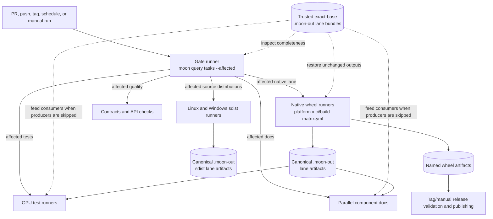

# Contributing to CUDA Python

Thank you for your interest in contributing to CUDA Python! Based on the type of contribution, it will fall into two categories:

1. You want to report a bug, feature request, or documentation issue:
    - File an [issue](https://github.com/NVIDIA/cuda-python/issues/new/choose)
    describing what you encountered or what you want to see changed.
    - The NVIDIA team will evaluate the issues and triage them, scheduling
    them for a release. If you believe the issue needs priority attention
    comment on the issue to notify the team.
2. You want to implement a feature, improvement, or bug fix:
   - Before starting work on an existing issue, please comment on the issue to express your interest and wait to be assigned by a maintainer. This helps avoid redundant effort in case the issue is already being worked on by another contributor or an NVIDIA team member.
   - Please refer to each component's guideline:
       - [`cuda.core`](https://nvidia.github.io/cuda-python/cuda-core/latest/contribute.html)
       - [`cuda.bindings`](https://nvidia.github.io/cuda-python/cuda-bindings/latest/contribute.html)<sup>[1](#footnote1)</sup>
       - [`cuda.pathfinder`](https://nvidia.github.io/cuda-python/cuda-pathfinder/latest/contribute.html)

## Table of Contents

- [Contributing to CUDA Python](#contributing-to-cuda-python)
  - [Table of Contents](#table-of-contents)
  - [Cloning the repository](#cloning-the-repository)
    - [Recommended clone](#recommended-clone)
    - [Fixing an existing clone](#fixing-an-existing-clone)
    - [Symptoms of a bad clone](#symptoms-of-a-bad-clone)
  - [Type stubs for cuda.core](#type-stubs-for-cudacore)
  - [Pre-commit](#pre-commit)
    - [Pre-commit on Windows](#pre-commit-on-windows)
  - [Signing Your Work](#signing-your-work)
  - [Code signing](#code-signing)
  - [Developer Certificate of Origin (DCO)](#developer-certificate-of-origin-dco)
  - [CI infrastructure overview](#ci-infrastructure-overview)
    - [Local and CI task orchestration with Moon](#local-and-ci-task-orchestration-with-moon)
    - [CI Pipeline Flow](#ci-pipeline-flow)
    - [Pipeline Execution Details](#pipeline-execution-details)
    - [Branch-specific Artifact Flow](#branch-specific-artifact-flow)
      - [Main Branch](#main-branch)
      - [Backport Branches](#backport-branches)
    - [Key Infrastructure Details](#key-infrastructure-details)
  - [Code coverage](#code-coverage)


## Cloning the repository

Every package in this repository derives its version from git tags using
[`setuptools-scm`](https://setuptools-scm.readthedocs.io/), so **how you clone
determines whether you can build at all, and whether the version you build is
correct.** Each package matches its own tag prefix:

| Package | Tag pattern |
| --- | --- |
| `cuda-bindings`, `cuda-python` | `v*` (e.g. `v13.3.1`) |
| `cuda-core` | `cuda-core-v*` (e.g. `cuda-core-v1.1.0`) |
| `cuda-pathfinder` | `cuda-pathfinder-v*` (e.g. `cuda-pathfinder-v1.6.0`) |

Each package sets `root = ".."` in its `[tool.setuptools_scm]` table, meaning the
version is read from the *repository root* rather than the package directory. A
working build therefore needs all of the following:

1. **A real git clone.** Source zips and GitHub "Download ZIP" archives have no
   git metadata and the build fails outright. (Tarballs produced by
   `git archive` do work, thanks to the `.git_archival.txt` substitutions
   configured in `.gitattributes`.)
2. **The full repository**, not just the package subdirectory, because the
   version lookup walks up to the repository root.
3. **Tags, reaching back at least as far as the most recent tag** matching the
   package you are building. `git describe` needs to find that tag; the history
   between it and your checkout must be present too.

### Recommended clone

The default `git clone` gives you everything you need:

```console
$ git clone https://github.com/NVIDIA/cuda-python.git
```


### Fixing an existing clone

If you already have a shallow clone:

```console
$ git fetch --unshallow --tags
```

If you are working from a personal fork, your fork's tags stop tracking upstream
the moment new releases are cut, which silently yields a stale version. Fetch
tags from upstream directly:

```console
$ git remote add upstream https://github.com/NVIDIA/cuda-python.git
$ git fetch --tags upstream
```

Keep doing this periodically — a fork that was correct when you created it will
drift.

### Symptoms of a bad clone

Only case 3 below reports an error. The first two fail *silently*, producing a
wrong version that surfaces much later as a confusing dependency-resolution or
version-check failure:

1. **No tags reachable.** The build succeeds and produces a version starting at
   `0.1.dev`: a `--depth 1` clone yields `0.1.dev1+g0d22cb444`, a full clone made
   with `--no-tags` yields `0.1.dev2114+g0d22cb444`. Installing `cuda-python`
   built this way then fails, because its `install_requires` pins
   `cuda-bindings` to that same bogus version.
2. **Stale tags** (a fork that has not fetched upstream in a while): you get a
   plausible-looking but wrong version, e.g. `13.0.4.dev650+g0d22cb44` when the
   real latest tag is `v13.3.1`. Nothing warns you. Note there is no leading
   `v` — the tag prefix is stripped by `tag_regex`.
3. **No git metadata** (source zip): the build fails with
   `LookupError: setuptools-scm was unable to detect version`.

As a last resort — for example when building inside a container that has no git
history — you can bypass the lookup entirely:

```console
$ SETUPTOOLS_SCM_PRETEND_VERSION_FOR_CUDA_CORE=1.1.0 pip install ./cuda_core
```

The environment variable is suffixed with the distribution name, uppercased with
hyphens replaced by underscores: `..._FOR_CUDA_BINDINGS`, `..._FOR_CUDA_CORE`,
`..._FOR_CUDA_PATHFINDER`, `..._FOR_CUDA_PYTHON`. Use this only when you
genuinely cannot provide tags; it is not a substitute for a correct clone.


## Type stubs for cuda.core

`cuda.core` is a PEP 561-compliant package: it ships a `py.typed` marker and
`.pyi` stub files alongside the Cython extensions.  The stubs
are checked into the repository.

**You do not need to run stubgen-pyx manually.**  A pre-commit hook
regenerates the corresponding `.pyi` files automatically when you commit.
The results are then also tested with `mypy`.

A few things to keep in mind:

- **Do not edit `.pyi` files by hand.**  They are regenerated from the Cython
  sources on every commit that touches those sources; manual edits will be
  overwritten.
- **Type annotations belong in the `.pyx`/`.pxd` source.**  stubgen-pyx reads
  Cython type annotations and docstrings to build the stubs, so keeping the
  source well-annotated is the right way to improve stub quality.
- **To run mypy manually (outside of pre-commit)**: `python -m mypy
  --config-file cuda_core/pyproject.toml

## Pre-commit
This project uses [pre-commit.ci](https://pre-commit.ci/) with GitHub Actions. All pull requests are automatically checked for pre-commit compliance, and any pre-commit failures will block merging until resolved.

To set yourself up for running pre-commit checks locally and to catch issues before pushing your changes, follow these steps:

* Install pre-commit with: `pip install pre-commit`
* Run this once per checkout: `pre-commit install`
* You can manually check all files at any time by running: `pre-commit run --all-files`

This command runs all configured hooks (such as linters and formatters) across your repository, letting you review and address issues before committing.

Installing the hook is required, not optional. Some of the automated checks
(the SPDX header updater and the `.pyi` stub generator for `cuda_core`) only
keep the tree consistent if they run on *every* commit. Relying on manual
`pre-commit run --all-files` invocations means these checks can be skipped
between commits, leaving stale headers or out-of-date stubs in the history.
If the hook isn't installed, `pre-commit run` (and CI) will print a visible
warning reminding you to run `pre-commit install`.

### Pre-commit on Windows

For development on Windows (not WSL), the `lychee` pre-commit task will not work
when running `pre-commit run --all-files`.  This problem does not occur if you
install the pre-commit hook and run it automatically as part of your `git
commit` workflow.  To resolve this, you can either:

1. Run `pre-commit` in Git Bash, rather than directly in PowerShell or cmd

2. Skip it by setting the environment variable `SKIP` to `lychee`.  This would
   be `$env:SKIP = "lychee"` in PowerShell or `set SKIP=lychee` in cmd.

## Secret Scanning

The `secret-scan-trufflehog` pre-commit hook scans staged files and installs TruffleHog into its own environment on first run, on Linux, macOS, and Windows. If it flags a secret, remove it before committing, or contact a maintainer if it's a false positive. Secrets are also scanned server-side in CI.


## Signing Your Work

Contributions to files licensed under Apache 2.0 must be certified under the
[Developer Certificate of Origin (DCO)](#developer-certificate-of-origin-dco).
Sign off every commit with the `-s` option:

```console
git commit -s -m "Describe your change"
```

Git uses your configured name and email address to add a trailer like this to
the commit message:

```text
Signed-off-by: Your Name <your.email@example.com>
```

Use your real name and an email address associated with your contribution. The
sign-off certifies that you have the right to submit the contribution under the
DCO below. DCO sign-off is separate from the cryptographic commit signing
described in the next section; both requirements apply.


## Code signing

This repository implements a security check to prevent the CI system from running untrusted code. A part of the security check consists of checking if the git commits are signed. Please ensure that your commits are signed [following GitHub’s instruction](https://docs.github.com/en/authentication/managing-commit-signature-verification/about-commit-signature-verification).


## Developer Certificate of Origin (DCO)
```
Version 1.1

Copyright (C) 2004, 2006 The Linux Foundation and its contributors.

Everyone is permitted to copy and distribute verbatim copies of this
license document, but changing it is not allowed.


Developer's Certificate of Origin 1.1

By making a contribution to this project, I certify that:

(a) The contribution was created in whole or in part by me and I
    have the right to submit it under the open source license
    indicated in the file; or

(b) The contribution is based upon previous work that, to the best
    of my knowledge, is covered under an appropriate open source
    license and I have the right under that license to submit that
    work with modifications, whether created in whole or in part
    by me, under the same open source license (unless I am
    permitted to submit under a different license), as indicated
    in the file; or

(c) The contribution was provided directly to me by some other
    person who certified (a), (b) or (c) and I have not modified
    it.

(d) I understand and agree that this project and the contribution
    are public and that a record of the contribution (including all
    personal information I submit with it, including my sign-off) is
    maintained indefinitely and may be redistributed consistent with
    this project or the open source license(s) involved.
```

## CI infrastructure overview

The CUDA Python project uses a comprehensive CI pipeline that builds, tests, and releases multiple components across different platforms. This section provides a visual overview of our CI infrastructure to help contributors understand the build and release process.

### Local and CI task orchestration with Moon

The draft CI orchestration spike uses [Moon 2.5.1](https://moonrepo.dev/moon) as the task graph and execution
engine for both local development and CI. Moon uses only the system toolchain in this repository: it does not
install, select, or configure Python, and it does not create Python environments. Existing Pixi and uv commands
remain supported and can still be invoked directly; Moon delegates to the environment that the contributor or CI
runner has already prepared.

Before running package-build tasks, make sure `python` resolves to the interpreter you intend to use. In an existing
virtual environment, uv environment, or Pixi environment, the CI build frontends can be installed without asking
Moon to manage Python:

```console
$ python -m pip install --constraint ci/build-constraints.txt pip build cibuildwheel twine wheel
```

Native wheel tasks also require the appropriate CUDA toolkit and platform compiler to already be active. Test and
documentation tasks continue to use the existing Pixi and uv environments declared by their projects.

Use Moon to inspect the graph, run one task locally, or execute the affected portion of the graph as CI does:

```console
$ moon projects
$ moon tasks
$ moon run <project>:<task>
$ moon run metapackage:wheel-pure
$ moon run root:test
$ moon run root:pure-wheel
$ MOON_BASE=origin/main MOON_HEAD=HEAD moon ci ':#ci-test-linux' --upstream deep --downstream none
```

CI workers follow Moon's CI model: after GitHub Actions provisions the required Python, CUDA toolkit, compiler, or
GPU, the worker invokes a tagged `moon ci` target group. Moon owns affected selection, task dependencies, command
execution, cache hits, and output hydration. GitHub Actions retains heterogeneous runner allocation, credentials,
and release or Pages publishing. The explicit `--downstream none` keeps work from crossing those runner-class
boundaries; upstream dependencies remain part of the Moon task graph where they share a cache and environment.

The current and previous CUDA variants of `cuda.core` are intentionally separate tasks because Moon does not
provision or switch CUDA toolkits. For a local merged wheel, activate the current toolkit and run the current wheel
tasks, stage the matching previous-branch `cuda.bindings` wheel, activate the previous toolkit and run
`core:wheel-previous`, then run `core:wheel-merge`. CI follows the same staged sequence and lets Moon parallelize
independent work within each phase.

The Cython test-asset tasks have a similar environment boundary. CI changes from the wheel-build interpreter to the
test interpreter before running `bindings:cython-test-assets` or `core:cython-test-assets`, so their pathfinder,
bindings, and core wheels are staged inputs rather than executable Moon dependencies. To run either task locally,
first build or copy exactly one current wheel for each package into its corresponding `.moon-out` directory.

Moon's `.moon/cache` remains local to each runner. For ephemeral-runner reuse, GitHub Actions instead transports the
canonical `.moon-out` directories in lane-qualified, immutable workflow artifacts. The gate accepts a lane only from
a successful trusted push run at the exact merge-base commit and only when every required artifact in that lane is
present. A producer restores those outputs before running `moon ci`, so affected tasks rebuild while unchanged staged
outputs remain available to their consumers. Tests and documentation may consume the same exact-base lane directly
when no producer is affected. Missing, expired, or incomplete lanes conservatively allocate and force the required
producer runner.

Conventional named wheel artifacts remain available to release tooling. Native lanes include the inexpensive
cuda-pathfinder wheel directly; the Linux/Python 3.12 lane also includes the cuda-python metapackage used by
non-release documentation. Context-sensitive documentation is rebuilt as parallel Moon tasks whenever its runner is
selected. Generated `.moon/cache` and `.moon-out` directories are ignored by Git.

CI sets `CUDA_PYTHON_USE_STAGED_BINDINGS_VERSION=1` when the metapackage must match a trusted staged
`cuda.bindings` development wheel. Leave this variable unset for normal local builds; `root:pure-wheel` then derives
the metapackage version from the current checkout and ignores any stale staged bindings output.

All isolated package builds set both `PIP_BUILD_CONSTRAINT` and `PIP_CONSTRAINT` from
`ci/build-constraints.txt`; CI also installs its build frontends from that file. Public `pyproject.toml` compatibility
ranges remain unchanged. Moon fingerprints the active interpreter, installed tools, selected environment, and native
compiler identities for its local cache. The builds still depend on provisioned runner, container, CUDA, and repair
tool environments, so they are not treated as a hermetic cross-revision remote cache. The production contract remains
the narrower exact-base `.moon-out` transport described above.

### CI Pipeline Flow


```mermaid
flowchart TD
    trigger["PR, push, tag, schedule, or manual run"] --> gate["Gate runner<br/>moon query tasks --affected"]
    base[("Trusted exact-base<br/>.moon-out lane bundles")] -. "inspect completeness" .-> gate

    gate -->|"affected native lane"| native["Native wheel runners<br/>platform x ci/build-matrix.yml"]
    gate -->|"affected source distributions"| sdist["Linux and Windows sdist runners"]
    gate -->|"affected tests"| tests["GPU test runners"]
    gate -->|"affected docs"| docs["Parallel component docs"]
    gate -->|"affected quality"| quality["Contracts and API checks"]

    base -. "restore unchanged outputs" .-> native
    base -. "feed consumers when producers are skipped" .-> tests
    base -. "feed consumers when producers are skipped" .-> docs
    native --> lanes[("Canonical .moon-out<br/>lane artifacts")]
    lanes --> tests
    lanes --> docs

    native --> named[("Named wheel artifacts")]
    sdist --> sdist_lanes[("Canonical .moon-out<br/>sdist lane artifacts")]
    named --> release["Tag/manual release validation and publishing"]
```

### Pipeline Execution Details

**Parallel Execution**: GitHub Actions allocates the required runner classes in parallel. Within each provisioned
environment, Moon schedules independent tasks concurrently while preserving package and staged-output dependencies.
The native Python ABI rows come from `ci/build-matrix.yml`, and CUDA versions come from `ci/versions.yml`.

### Branch-specific Artifact Flow

#### Main Branch
- **Build** → **Test** → **Documentation** → **Potential Release**
- Canonical `.moon-out` lane artifacts feed affected CI; named wheel artifacts feed release tooling
- Full test coverage across all platforms and CUDA versions
- **Artifact flow out**: `cuda-pathfinder` artifacts → backport branches

#### Backport Branches
- **Build** → **Test** → **Backport PR Creation**
- Artifacts used for validation before creating backport pull requests
- Maintains compatibility with older CUDA versions
- **Artifact flow in**: `cuda-pathfinder` artifacts ← main branch
- **Artifact flow out**: older `cuda-bindings` artifacts → main branch

### Key Infrastructure Details

- **Self-hosted runners**: Used for Linux builds and GPU testing (more resources, faster builds)
- **GitHub-hosted runners**: Used for Windows builds and general tasks
- **Artifact retention**: 30 days for reusable Moon lanes; specialized artifacts declare their own retention
- **Cache ownership**: Moon caches remain runner-local; GitHub caches CTK and compiler downloads separately
- **Security**: All commits must be signed, untrusted code blocked
- **Parallel execution**: Matrix builds across Python versions and platforms
- **Component isolation**: Core, bindings, pathfinder, and the metapackage can be built or released independently

## Code coverage

Code coverage reports are produced nightly and posted to [GitHub Pages](https://nvidia.github.io/cuda-python/coverage).

Known limitations: Code coverage is only run on Linux x86_64 with an a100 GPU.  We plan to add more platform and GPU coverage in the future.

---

<a>1</a>: The `cuda-python` meta package shares the same license and the contributing guidelines as those of `cuda-bindings`.
