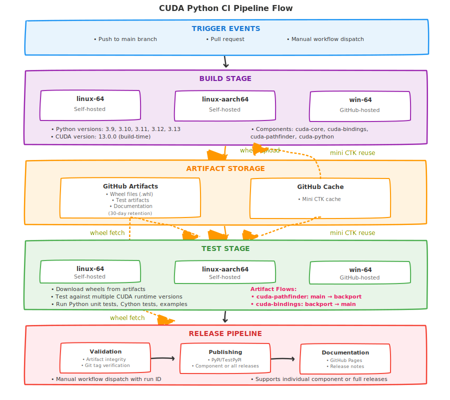

# Contributing to CUDA Python

Thank you for your interest in contributing to CUDA Python! Based on the type of contribution, it will fall into two categories:

1. You want to report a bug, feature request, or documentation issue:
    - File an [issue](https://github.com/NVIDIA/cuda-python/issues/new/choose)
    describing what you encountered or what you want to see changed.
    - The NVIDIA team will evaluate the issues and triage them, scheduling
    them for a release. If you believe the issue needs priority attention
    comment on the issue to notify the team.
2. You want to implement a feature, improvement, or bug fix:
    - Please refer to each component's guideline:
       - [`cuda.core`](https://nvidia.github.io/cuda-python/cuda-core/latest/contribute.html)
       - [`cuda.bindings`](https://nvidia.github.io/cuda-python/cuda-bindings/latest/contribute.html)<sup>[1](#footnote1)</sup>
       - [`cuda.pathfinder`](https://nvidia.github.io/cuda-python/cuda-pathfinder/latest/contribute.html)

## Table of Contents

- [Pre-commit](#pre-commit)
- [Code signing](#code-signing)
- [Developer Certificate of Origin (DCO)](#developer-certificate-of-origin-dco)
- [CI infrastructure overview](#ci-infrastructure-overview)


## Pre-commit
This project uses [pre-commit.ci](https://pre-commit.ci/) with GitHub Actions. All pull requests are automatically checked for pre-commit compliance, and any pre-commit failures will block merging until resolved.

To set yourself up for running pre-commit checks locally and to catch issues before pushing your changes, follow these steps:

* Install pre-commit with: `pip install pre-commit`
* You can manually check all files at any time by running: `pre-commit run --all-files`

This command runs all configured hooks (such as linters and formatters) across your repository, letting you review and address issues before committing.

**Optional: Enable automatic checks on every commit**
If you want pre-commit hooks to run automatically each time you make a commit, install the git hook with:

`pre-commit install`

This sets up a git pre-commit hook so that all configured checks will run before each commit is accepted. If any hook fails, the commit will be blocked until the issues are resolved.

**Note on workflow flexibility**
Some contributors prefer to commit intermediate or work-in-progress changes that may not pass all pre-commit checks, and only clean up their commits before pushing (for example, by squashing and running `pre-commit run --all-files` manually at the end). If this fits your workflow, you may choose not to run `pre-commit install` and instead rely on manual checks. This approach avoids disruption during iterative development, while still ensuring code quality before code is shared or merged.

Choose the setup that best fits your workflow and development style.


## Code signing

This repository implements a security check to prevent the CI system from running untrusted code. A part of the security check consists of checking if the git commits are signed. Please ensure that your commits are signed [following GitHub’s instruction](https://docs.github.com/en/authentication/managing-commit-signature-verification/about-commit-signature-verification).


## Developer Certificate of Origin (DCO)
```
Version 1.1

Copyright (C) 2004, 2006 The Linux Foundation and its contributors.

Everyone is permitted to copy and distribute verbatim copies of this
license document, but changing it is not allowed.


Developer's Certificate of Origin 1.1

By making a contribution to this project, I certify that:

(a) The contribution was created in whole or in part by me and I
    have the right to submit it under the open source license
    indicated in the file; or

(b) The contribution is based upon previous work that, to the best
    of my knowledge, is covered under an appropriate open source
    license and I have the right under that license to submit that
    work with modifications, whether created in whole or in part
    by me, under the same open source license (unless I am
    permitted to submit under a different license), as indicated
    in the file; or

(c) The contribution was provided directly to me by some other
    person who certified (a), (b) or (c) and I have not modified
    it.

(d) I understand and agree that this project and the contribution
    are public and that a record of the contribution (including all
    personal information I submit with it, including my sign-off) is
    maintained indefinitely and may be redistributed consistent with
    this project or the open source license(s) involved.
```

## CI infrastructure overview

The CUDA Python project uses a comprehensive CI pipeline that builds, tests, and releases multiple components across different platforms. This section provides a visual overview of our CI infrastructure to help contributors understand the build and release process.

### CI Pipeline Flow



Alternative Mermaid diagram representation:

```mermaid
flowchart TD
    %% Trigger Events
    subgraph TRIGGER["🔄 TRIGGER EVENTS"]
        T1["• Push to main branch"]
        T2["• Pull request<br/>• Manual workflow dispatch"]
        T1 --- T2
    end

    %% Build Stage
    subgraph BUILD["🔨 BUILD STAGE"]
        subgraph BUILD_PLATFORMS["Parallel Platform Builds"]
            B1["linux-64<br/>(Self-hosted)"]
            B2["linux-aarch64<br/>(Self-hosted)"]
            B3["win-64<br/>(GitHub-hosted)"]
        end
        BUILD_DETAILS["• Python versions: 3.9, 3.10, 3.11, 3.12, 3.13<br/>• CUDA version: 13.0.0 (build-time)<br/>• Components: cuda-core, cuda-bindings,<br/>  cuda-pathfinder, cuda-python"]
    end

    %% Artifact Storage
    subgraph ARTIFACTS["📦 ARTIFACT STORAGE"]
        subgraph GITHUB_ARTIFACTS["GitHub Artifacts"]
            GA1["• Wheel files (.whl)<br/>• Test artifacts<br/>• Documentation<br/>(30-day retention)"]
        end
        subgraph GITHUB_CACHE["GitHub Cache"]
            GC1["• Mini CTK cache"]
        end
    end

    %% Test Stage
    subgraph TEST["🧪 TEST STAGE"]
        subgraph TEST_PLATFORMS["Parallel Platform Tests"]
            TS1["linux-64<br/>(Self-hosted)"]
            TS2["linux-aarch64<br/>(Self-hosted)"]
            TS3["win-64<br/>(GitHub-hosted)"]
        end
        TEST_DETAILS["• Download wheels from artifacts<br/>• Test against multiple CUDA runtime versions<br/>• Run Python unit tests, Cython tests, examples"]
        ARTIFACT_FLOWS["Artifact Flows:<br/>• cuda-pathfinder: main → backport<br/>• cuda-bindings: backport → main"]
    end

    %% Release Pipeline
    subgraph RELEASE["🚀 RELEASE PIPELINE"]
        subgraph RELEASE_STAGES["Sequential Release Steps"]
            R1["Validation<br/>• Artifact integrity<br/>• Git tag verification"]
            R2["Publishing<br/>• PyPI/TestPyPI<br/>• Component or all releases"]
            R3["Documentation<br/>• GitHub Pages<br/>• Release notes"]
            R1 --> R2 --> R3
        end
        RELEASE_DETAILS["• Manual workflow dispatch with run ID<br/>• Supports individual component or full releases"]
    end

    %% Main Flow
    TRIGGER --> BUILD
    BUILD -.->|"wheel upload"| ARTIFACTS
    ARTIFACTS -.-> TEST
    TEST --> RELEASE

    %% Artifact Flow Arrows (Cache Reuse)
    GITHUB_CACHE -.->|"mini CTK reuse"| BUILD
    GITHUB_CACHE -.->|"mini CTK reuse"| TEST

    %% Artifact Flow Arrows (Wheel Fetch)
    GITHUB_ARTIFACTS -.->|"wheel fetch"| TEST
    GITHUB_ARTIFACTS -.->|"wheel fetch"| RELEASE

    %% Styling
    classDef triggerStyle fill:#e8f4fd,stroke:#2196F3,stroke-width:2px,color:#1976D2
    classDef buildStyle fill:#f3e5f5,stroke:#9C27B0,stroke-width:2px,color:#7B1FA2
    classDef artifactStyle fill:#fff3e0,stroke:#FF9800,stroke-width:2px,color:#F57C00
    classDef testStyle fill:#e8f5e8,stroke:#4CAF50,stroke-width:2px,color:#388E3C
    classDef releaseStyle fill:#ffebee,stroke:#f44336,stroke-width:2px,color:#D32F2F

    class TRIGGER,T1,T2 triggerStyle
    class BUILD,BUILD_PLATFORMS,B1,B2,B3,BUILD_DETAILS buildStyle
    class ARTIFACTS,GITHUB_ARTIFACTS,GITHUB_CACHE,GA1,GC1 artifactStyle
    class TEST,TEST_PLATFORMS,TS1,TS2,TS3,TEST_DETAILS,ARTIFACT_FLOWS testStyle
    class RELEASE,RELEASE_STAGES,R1,R2,R3,RELEASE_DETAILS releaseStyle
```



### Pipeline Execution Details

**Parallel Execution**: The CI pipeline leverages parallel execution to optimize build and test times:
- **Build Stage**: Different architectures/operating systems (linux-64, linux-aarch64, win-64) are built in parallel across their respective runners
- **Test Stage**: Different architectures/operating systems/CUDA versions are tested in parallel; documentation preview is also built in parallel with testing

### Branch-specific Artifact Flow

#### Main Branch
- **Build** → **Test** → **Documentation** → **Potential Release**
- Artifacts stored as `{component}-python{version}-{platform}-{sha}`
- Full test coverage across all platforms and CUDA versions
- **Artifact flow out**: `cuda-pathfinder` artifacts → backport branches

#### Backport Branches
- **Build** → **Test** → **Backport PR Creation**
- Artifacts used for validation before creating backport pull requests
- Maintains compatibility with older CUDA versions
- **Artifact flow in**: `cuda-pathfinder` artifacts ← main branch
- **Artifact flow out**: older `cuda-bindings` artifacts → main branch

### Key Infrastructure Details

- **Self-hosted runners**: Used for Linux builds and GPU testing (more resources, faster builds)
- **GitHub-hosted runners**: Used for Windows builds and general tasks
- **Artifact retention**: 30 days for GitHub Artifacts (wheels, docs, tests)
- **Cache retention**: GitHub Cache for build dependencies and environments
- **Security**: All commits must be signed, untrusted code blocked
- **Parallel execution**: Matrix builds across Python versions and platforms
- **Component isolation**: Each component (core, bindings, pathfinder, python) can be built/released independently

---

<a>1</a>: The `cuda-python` meta package shares the same license and the contributing guidelines as those of `cuda-bindings`.
