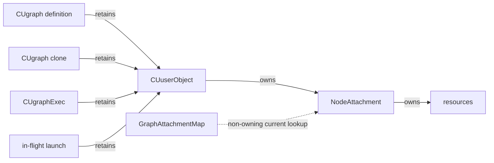
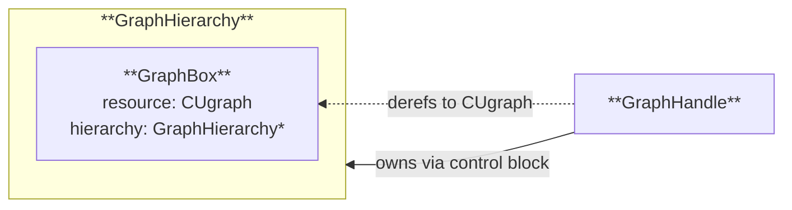

# Graph Node Attachments

## Why attachments are needed

CUDA graph work has three stages: definition, instantiation, and execution. An
application builds a mutable `CUgraph`, instantiates a snapshot as a
`CUgraphExec`, then launches that executable one or more times. The `CUgraph`
is composed of `CUgraphNode` objects. Each node has a complete parameter set,
and those parameters can be replaced after the node is created.

A `CUgraph` may also be cloned or embedded as a child graph. Cloning,
embedding, and instantiation each copy the source graph's current nodes and
parameters. The copy then has an independent lifetime: later changes to the
source do not affect it. An embedded copy is owned by its parent node and is
destroyed with that node.

Node parameters may refer to kernels, memory, events, callbacks, or other
resources that CUDA does not own. Their lifetimes cannot simply follow the
source node because copied or previously launched work may continue to use old
parameters after the source changes.

For example, suppose a kernel node refers to allocation A when its graph is
instantiated. Updating the source node to refer to allocation B leaves the
executable graph using A. If that executable is launched and then successfully
updated from the source graph, future launches use B while the earlier launch
continues to use A. Releasing A at either update would leave the executable or
launch with a dangling pointer.

At any instant, one logical node may therefore have several complete parameter
sets in use. cuda.core knows which parameters are current in a graph
definition, but not which clones, executable graphs, or asynchronous launches
still use older sets. Only CUDA can track the lifetimes of all those consumers;
CUDA user objects provide the mechanism for tying resource lifetime to those
consumers.

cuda.core uses this mechanism by treating each complete parameter set as a
separate lifetime unit, called a **parameter version**. Adding or updating a
node creates a new version, and multiple versions may be live at once. The
resources referenced by each version must remain alive until all of its CUDA
consumers have finished.

To enforce this rule, cuda.core packages each version's resource owners in one
`NodeAttachment`. Once published, its owner bundle is immutable. Replacing the
complete bundle as a unit prevents torn ownership state. A graph-retained CUDA
user object owns the attachment, allowing CUDA to preserve it across clones,
executable graphs, and in-flight launches and release it after the last
consumer finishes.

## Ownership model

For each resource-bearing parameter version, cuda.core:

1. Collects its resources in a `NodeAttachment` whose owner bundle is immutable
   after publication (although the resources it keeps alive may themselves be
   mutable).
2. Creates a CUDA user object that owns the attachment.
3. Retains one user-object reference on the `CUgraph`.

CUDA copies graph-owned user-object references when it clones or instantiates a
graph. It also keeps the references needed by in-flight launches. Replacing or
deleting a source node therefore releases only the source graph's reference.
Clones, executable graphs, and launches retain the old attachment for as long
as they need it.

The CUDA user-object reference count controls the attachment lifetime.
`GraphAttachmentMap` only lets cuda.core find the attachment currently
associated with a node.

Each `NodeAttachment` contains two type-erased `OpaqueHandle` owners:

- kernel: kernel and argument storage
- host callback: callback and copied user data
- memcpy: destination and source
- memset or event: destination or event in the first owner

`OpaqueHandle` is `shared_ptr<const void>`. Existing cuda.core handles reuse
their shared ownership when converted to it. Python objects and copied callback
data use custom deleters.

This immutability is structural: cuda.core never modifies either owner in a
published attachment. The resources those owners keep alive, including Python
objects, may remain mutable, but they must not be modified in a way that
releases resources still referenced by an installed parameter version.

## Deferred cleanup

CUDA invokes a user-object destructor on an internal thread where CUDA API
calls are forbidden. Destroying an attachment there could release handles whose
deleters call CUDA or run Python finalizers.

`NodeAttachment` therefore inherits from `DeferredCleanupItem`. The CUDA
destructor callback only adds the attachment to the process-lifetime
`DeferredCleanupQueue` and requests a `Py_AddPendingCall`.

One pending call drains all queued attachments from Python's main thread. The
queue coalesces work because CPython's pending-call queue is bounded. If
scheduling fails, attachments stay queued and a later enqueue or safe cuda.core
entry retries. Graph and executable-graph destruction and explicit close paths
provide additional retry points. During Python finalization, scheduling stops
and unreclaimable attachments are intentionally leaked rather than destroyed
in an unsafe context.

## Graph hierarchy state

One `GraphHierarchy` represents a root graph and every CUDA-owned child or
conditional-body graph below it. Every graph in the hierarchy has one
canonical `GraphBox`.

A `GraphHandle` (type `std::shared_ptr<const CUgraph>`) points to a
`GraphBox::resource` while sharing ownership of the whole `GraphHierarchy`.
Holding any root or child handle therefore keeps the entire hierarchy
alive. Only the root graph is destroyed with `cuGraphDestroy`; CUDA itself
destroys embedded child graphs.

`GraphHierarchy::graphs` is a list of live `GraphBox` objects containing
metadata for the root graph and subgraphs. Each `GraphBox` stores:

- the `CUgraph`
- its parent box and owning node, when it is a child graph
- a `GraphAttachmentMap` from nodes to node attachments (`NodeAttachment*`)
- a per-graph weak registry to canonicalize node handles

When CUDA destroys a child graph, the associated `GraphBox` is cleared and
moved to `GraphHierarchy::graveyard`. That invalidates existing handles and
preserves the storage until the hierarchy's last shared owner is released.
Removing the registry entry also prevents corruption if a future CUDA graph
reuses the raw handle value.

The process-wide graph registry maps a live `CUgraph` to its canonical
`GraphHandle`. Node handles are scoped to their `GraphBox`, where they can all
be invalidated when CUDA destroys that graph. They use separate
`GraphNodeBox::resource` fields and are nulled before the graph box is retired.

## Invariants

1. The owner bundle of a published `NodeAttachment` is never modified in place.
2. CUDA user-object references, not metadata pointers, own attachments.
3. Metadata is removed or replaced before its graph reference is released.
4. Fallible attachment setup and metadata allocation happen before the CUDA
   graph mutation they support.
5. Every live cuda.core `CUgraph` has one canonical `GraphBox` and registry
   entry.
6. Graph boxes remain in parent-before-child order.
7. Destroyed child boxes remain at stable addresses in the graveyard.
8. A raw graph handle is unregistered before its box becomes a tombstone.
9. CUDA callbacks only enqueue attachments; they never release owners or call
   CUDA.
10. Graph mutations and their metadata updates require the same external
   synchronization as the underlying CUDA graph.

## Scope

- Attachment metadata tracks graph mutations performed through cuda.core.
- Raw driver clones receive the CUDA user-object references needed for safe
  execution, but cuda.core cannot reconstruct their node-to-attachment map.
- Executable graphs rely on CUDA's inherited user-object references; they do
  not use `GraphAttachmentMap`.
- Direct executable-node updates require separate executable ownership and are
  not tracked by definition attachment metadata.
- Stream capture explicitly retains host callbacks. Other captured operations
  keep their documented caller-owned lifetime contract.
- CPython's cyclic garbage collector cannot follow the ownership path from a
  CUDA graph through a driver-held CUDA user object to an attached Python
  parameter. Reference cycles involving attached Python parameters therefore
  cannot be collected and are resource leaks.
